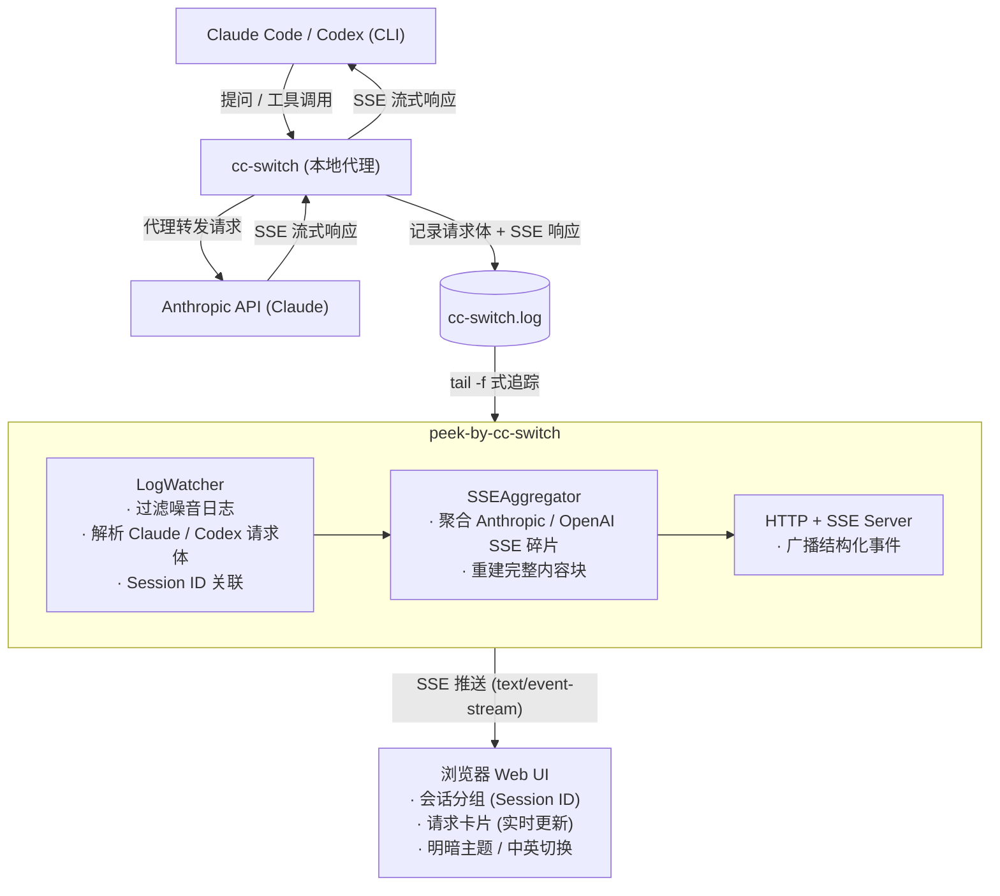

# peek-by-cc-switch — Claude Code / Codex 日志监控工具

## cc-switch作者推荐

> 开玩笑的哈:) 应该是AI自动处理的issue https://github.com/farion1231/cc-switch/issues/1227


## 背景

使用 Claude Code 或 Codex CLI 时，CLI 只展示部分和最终结果，很多过程是黑盒的：

- **运行状态不透明** — 不知道 Claude Code 是在思考、调用工具还是卡住了，部分请求在 CLI 中完全没有展示
- **想学习内部机制** — Claude Code 的系统提示词、PlanMode 等功能组件是如何工作的，只有看到完整的 API 请求/响应才能理解
- **调试 Skills 困难** — 自定义 Skills 触发后具体发生了什么、完整的 trace 链路是怎样的，缺乏可观测性

[CC Switch](https://github.com/farion1231/cc-switch) 作为 Claude Code / Codex 的代理工具，同时提供会话管理和基础记录查看。本地代理和日志记录功能结合后，所有 API 请求和响应都会记录到 `~/.cc-switch/logs/cc-switch.log`。但这个日志存在两个问题：

1. **噪音过多** — 日志中混杂了大量无关内容（TrayIcon 事件、连接池、更新检测等），关键信息被淹没
2. **SSE 碎片化** — Claude API 的响应以 SSE 流式方式记录，一条完整回复被拆成几十到几百行 `content_block_delta`，无法直接阅读

**peek-by-cc-switch** 就是为了解决这些问题而创建的：实时监控日志，过滤噪音，聚合 SSE 碎片，重建完整对话，以可交互的 Web UI 展示。

## 快速开始
1. cc-switch 已安装并正常使用，且日志文件路径已知（默认为 `~/.cc-switch/logs/cc-switch.log`）
2. cc-switch
   1. 设置-代理-本地代理-代理总开关(打开)，代理启用claude(打开),启用日志记录(打开)

   3. 设置-高级-日志管理-日志级别(至少 debug(调试))，启用日志(打开)


3. git clone 本项目，进入目录
4. 运行 `python watch_claude.py`，监听 cc-switch 日志文件，轮询间隔 5s，自动打开浏览器访问 `http://localhost:8765`
5. 在 Claude Code CLI 中 发起对话，观察 Web UI 实时展示请求和响应


## 技术原理 / 数据流向



## 架构设计

零外部依赖，仅使用 Python 标准库。按功能模块拆分，前端 CSS/JS 独立文件可获得 IDE 语法支持。

```
watch_claude.py (入口)
│
├── watcher/
│   ├── config.py         → 默认配置、全局状态、broadcast_event
│   ├── utils.py          → 八进制转义解码、日志行解析
│   ├── aggregator.py     → SSEAggregator 状态机
│   ├── log_watcher.py    → LogWatcher 后台守护线程
│   └── server.py         → RequestHandler (HTTP + SSE + HTML 拼装)
│
├── static/
│   ├── style.css         → 所有 CSS（主题变量、布局、组件样式）
│   └── script.js         → 所有 JS（i18n、SSE 连接、卡片/会话管理）
│
└── templates/
    └── index.html        → HTML 骨架，{{STYLE}}/{{SCRIPT}} 占位符
```

### 核心组件

```
ThreadingHTTPServer (HTTP + SSE 服务器)
├── GET /             → 返回拼装后的完整 HTML 页面（CSS/JS 内联注入）
├── GET /events       → SSE 长连接，实时推送解析后的日志事件
├── POST /api/set-file     → 切换监控的日志文件
└── POST /api/set-interval → 修改轮询间隔

LogWatcher (后台守护线程)
├── 文件追踪: open() + seek + 轮询 (0.3s)，检测截断/轮转
├── 日志过滤: 仅处理 proxy::forwarder、proxy::response_processor 和 proxy::handler_context 模块
├── Session 追踪: 从 handler_context 提取 Session ID，关联同一 Claude Code 对话的多次请求
└── 日志解析: 正则提取请求 URL、请求体、SSE 事件、完成统计

SSEAggregator (SSE 碎片聚合状态机)
├── Claude / Anthropic:
│   ├── message_start / content_block_* / message_delta / message_stop
│   └── 重建 thinking / text / tool_use
└── Codex / OpenAI Responses:
    ├── response.output_item.* / response.output_text.* / response.function_call_arguments.*
    └── 重建 text / tool_use
```

## Claude Code / Codex 统一支持说明

### 1. Codex 支持原理

Claude Code 和 Codex 的核心差异不在前端，而在日志协议：

- Claude Code 主要对应 Anthropic Messages API，日志中记录的是 `message_start`、`content_block_start`、`content_block_delta`、`content_block_stop`、`message_delta` 等事件
- Codex 主要对应 OpenAI Responses API，日志中记录的是 `response.created`、`response.output_item.added`、`response.content_part.added`、`response.output_text.delta`、`response.output_item.done`、`response.function_call_arguments.delta` 等事件

为了兼容两套协议，后端没有把 Codex 单独做一套前端，而是做了“协议解析层 + 统一事件层”：

- `LogWatcher` 负责把原始日志行识别为“新请求 / 请求体 / SSE 事件 / 请求完成”
- `SSEAggregator` 负责按不同协议重建完整输出块
- 前端只消费统一后的结构化事件，不关心这次请求来自 Claude Code 还是 Codex

### 2. Codex 请求体解析字段与规则

Codex 请求体和 Claude 请求体的字段结构不同，当前解析规则如下：

- 顶层系统指令：
  - 优先读取 `instructions`
  - 同时兼容 `system`
  - 最终统一广播为 `context_message(role=system)`

- 输入消息：
  - Claude 读取 `messages`
  - Codex 读取 `input`
  - `input` 中只处理带 `role` 的 message 项
  - `developer` 被映射为 `system-reminder`
  - `system`、`user`、`assistant` 保持原角色

- 消息内容提取：
  - 支持字符串内容
  - 支持数组内容块
  - 目前会提取 `text`、`input_text`、`output_text`、`refusal`
  - `tool_use` 会转成可读占位文本
  - `tool_result` 会展开其中的文本内容

- 最后一条用户消息标记：
  - Claude: `messages` 中最后一个 `role=user`
  - Codex: `input` 中最后一个 `role=user`
  - 会统一附加 `is_last=true`

- 工具定义提取：
  - 统一读取 `tools`
  - 工具名缺失时回退到 `type`
  - `parameters` / `input_schema` / `format` 会统一映射成前端使用的 `input_schema`

- 推理内容处理：
  - Codex 的 `reasoning.encrypted_content` 当前不会在页面展示
  - 原因是它本身不可直接读，且和 Claude 的可视化 `thinking` 不是同一种数据

### 3. 架构调整

为了同时支持 Claude Code 和 Codex，架构上的关键调整有两类。

第一类是解析协议从“单协议”升级为“多协议”：

- `watcher/aggregator.py`
  - 旧逻辑只聚合 Claude 的 `content_block_*`
  - 新逻辑同时支持 Claude Messages SSE 和 Codex Responses SSE

- `watcher/log_watcher.py`
  - 旧逻辑主要理解 Claude 风格请求体
  - 新逻辑同时解析 Claude 的 `messages/system` 和 Codex 的 `instructions/input/tools`

第二类是请求跟踪从“单当前请求”升级为“按 client 维护请求状态”：

- 旧逻辑：
  - 只有 `current_request_id`
  - 只有 `current_aggregator`
  - 默认日志严格串行

- 新逻辑：
  - 每个 client 独立维护状态
  - client tag 会统一转小写，避免 `[Codex]` / `[codex]` 断链
  - 每个 client 有自己的 `request_queue`
  - 支持同一 client 下连续请求、交错请求，以及跨 session 混合存在

### 4. 数据结构统筹

为了让 Claude Code 和 Codex 都走同一套前后端契约，内部数据结构做了统一。

后端请求状态统一为：

```python
{
  "id": request_id,
  "aggregator": SSEAggregator(...),
  "response_id": None,
  "item_ids": set(),
  "body_received": False,
  "session_id": "...",
}
```

含义：

- `id`
  - 前端卡片主键，Claude / Codex 共用
- `aggregator`
  - 当前请求对应的 SSE 聚合器
- `response_id`
  - Codex / OpenAI Responses 的响应 ID，用于把后续流式事件绑定回请求
- `item_ids`
  - Codex 输出项 ID 集合，用于把 `response.output_item.*` 和 `response.output_text.*` 继续绑定回原请求
- `body_received`
  - 标记该请求体是否已经被消费，防止后续请求体广播错位
- `session_id`
  - 该请求所属会话，用于前端分组和完成事件修正

聚合层统一输出为三类内容块：

- `thinking`
- `text`
- `tool_use`

其中：

- Claude 可以自然产生 `thinking / text / tool_use`
- Codex 当前主要产生 `text / tool_use`
- 前端仍然只理解这三类，不需要为 Codex 单独写新组件

### 5. 前后端事件兼容策略

本项目没有为 Codex 引入新的前端事件协议，而是保持原事件模型不变：

- `request_start`
- `request_body`
- `context_message`
- `tools_list`
- `content_block`
- `request_complete`

这样做的目的有两个：

- 前端 UI 不需要区分 Claude Code 和 Codex，只按统一事件渲染
- 新协议支持主要集中在后端，前端改动尽量小

兼容规则如下：

- Claude / Codex 都会先发 `request_start`
- 请求体解析成功后统一发 `request_body`
- 历史上下文统一发 `context_message`
- 工具定义统一发 `tools_list`
- SSE 聚合后的正文统一发 `content_block`
- 完成统计统一发 `request_complete`

前端只认 `id` 和 `session_id`：

- `id` 决定内容落到哪张卡片
- `session_id` 决定卡片归属到哪个会话分组

另外，前端增加了 `pendingCardOps`：

- 如果 `content_block` / `tools_list` / `request_complete` 先到，但卡片还没创建
- 这些操作会先缓存
- 等卡片创建后再统一回放

这样 Claude 和 Codex 都能容忍“事件先到、卡片后到”的时序抖动。

### 6. 当前遗留问题和原因

虽然已经支持 Codex，并修掉了多轮错绑、跨会话串卡等主要问题，但仍有一些遗留风险。

1. 某些 Codex 流式事件仍然缺少足够强的请求标识

- OpenAI Responses 的部分事件没有 `response.id`
- 有些阶段只能依赖 `item_id`、`request_queue` 和到达顺序推断
- 这意味着在极端并发、乱序日志、跨 session 高频交错时，仍可能存在误绑定风险

2. `request_complete` 仍然缺少“请求级唯一回填键”

- 当前完成事件优先用 `session=` 匹配请求
- 这已经解决了跨 session 串卡
- 但如果同一 session 内存在真正的乱序完成，而日志里又没有可直接映射到前面 request 的稳定唯一键，理论上仍可能把统计信息匹配到同 session 的另一张卡

3. 请求体与首个输出事件之间仍依赖日志顺序

- 当前通过 `body_received`、`response_id`、`item_ids` 来尽量对齐
- 但如果代理层日志延迟非常异常，例如旧请求的请求体、首个输出、完成行在时间上被严重打散，仍然会增加推断成本

4. Codex 的加密推理内容暂未可视化

- `reasoning.encrypted_content` 不是可直接展示的纯文本
- 当前策略是忽略这部分，只展示可还原的文本输出和工具调用
- 这会让 Codex 页面上的“思考过程”可见性弱于 Claude 的 `thinking`

这些遗留问题的根本原因不是前端，而是：

- Claude Messages SSE 和 OpenAI Responses SSE 的日志结构天然不同
- Codex 的事件链更分散，且部分事件缺少直接 request 级关联键
- 当前项目又必须在“只读 cc-switch 日志”的前提下做离线推断，而不是直接接管 API 请求上下文

### 为什么用 SSE 而不是 WebSocket

通信模式是 **服务端 → 客户端** 为主（推送日志事件），客户端 → 服务端只有 2 个操作（切换文件、修改间隔），用普通 HTTP POST 即可。SSE 是普通 HTTP + `text/event-stream`，Python 标准库直接支持，浏览器原生 `EventSource` API，无需手写 WebSocket 协议。

## 功能特性

### 日志解析

| 日志标记 | 含义 | 处理方式 |
|---------|------|---------|
| `Session ID:` | Session 声明（handler_context） | 记录当前 Session ID，关联后续请求 |
| `>>> 请求 URL:` | 新请求开始 | 提取 URL、model、时间戳，附带 session_id |
| `>>> 请求体内容` | 请求体 JSON | 提取 system 指令 + tools 工具定义 + 全部对话消息，分块广播 |
| `<<< SSE 事件:` | 流式响应碎片 | 按 type 分发到 SSE 聚合器 |
| `记录请求日志:` | 请求完成 | 提取 status、latency、tokens 统计 |
| `[FWD-002]` | 所有 Provider 失败 | 以 status=502 关闭当前请求卡片 |

### Web UI

- **会话分组（双栏布局）** — 左侧会话列表 + 右侧请求卡片。同一 Claude Code 对话（共享 Session ID）的多次请求归入同一会话，点击左侧切换查看
  - **侧边栏收起/展开** — sidebar-header 右侧 `«` 按钮可折叠侧边栏（CSS transition 平滑动画，宽度过渡到 0），折叠后左侧显示窄条 `»` 展开按钮，右侧主内容区自动撑满。折叠状态通过 `localStorage` (`cc-watch-sidebar-collapsed`) 持久化，刷新页面后自动恢复
  - 会话列表项显示模型名称、创建时间、最后更新时间和请求次数
  - 按最后更新时间倒序排列，有新请求的会话自动排到顶部
  - 首个请求到达时自动选中对应会话
  - 请求完成时根据 `记录请求日志` 中的 `session=` 字段自动修正归属，避免跨会话误分
- **请求卡片** — 每次 API 交互一张卡片，按时间倒序排列
- **分区块展示** — 系统指令（灰）、工具列表（靛蓝）、系统提醒（橙）、用户消息（蓝）、助手回复（绿/半透明）、Thinking（紫）、回复（绿）、工具调用（橙）、统计栏（灰）
- **完整日志开关** — 工具栏右侧 checkbox，默认关闭。关闭时只展示最后一条用户消息和 SSE 响应；开启后，后续新请求会完整展示系统指令、系统提醒（`<system-reminder>`）和历史对话。状态保存到 localStorage
- **完整请求体展示** — 开启完整日志后，将 Claude API 请求体中的所有内容分块展示：顶层 system prompt（📋 系统指令）、tools 工具定义列表（🛠 工具列表）、`<system-reminder>` 内容（📌 系统提醒，从用户消息中拆分）、完整对话历史、最后一条用户消息。历史消息默认折叠，最后一条用户消息默认展开
- **工具列表展示** — 从请求体 `tools` 数组提取，仅在完整日志模式下显示，默认折叠。每个工具以独立卡片展示：工具名（monospace accent 色）、description（3 行截断 + 展开/收起按钮）、input_schema（格式化 JSON + 右上角复制按钮）。支持整体复制（全部 tools JSON）和单个工具复制。展示位置在系统指令之后、系统提醒之前
- **超长日志截断** — 请求体/SSE 解析失败时，错误面板中的原始日志截断到 500 字符并附带总长度提示，防止 82KB+ 的 raw_log 通过 SSE 广播到前端
- **折叠/展开** — 卡片级别和内容块级别独立折叠，折叠时显示首行预览；`addBlock` 支持 `defaultCollapsed` 参数控制初始折叠状态
- **长内容截断** — 内容块高度超过 200px 时自动截断，底部显示渐变遮罩（颜色匹配各块类型背景），附带居中的"▾ 展开"按钮；点击展开后显示全文，按钮变为"▴ 收起"。截断按钮放在 `contentDiv` 外部（`block` 的直接子元素），避免被 `overflow: hidden` 裁掉。默认折叠的块通过 `_needsClampCheck` 标记延迟到展开时再检查
- **内容块复制** — 每个内容块展开后，左上角（对齐 header ▼ 箭头下方）显示 `⧉` 复制图标，绝对定位确保所有块类型位置一致；点击复制该块的纯文本内容（不含图标），收起时随内容区隐藏
- **JSON 报文复制** — 卡片 header 状态码右侧的"复制JSON"按钮，点击后复制该请求的完整原始报文（`{request: 请求体, response: {content: [响应块]}}`）为格式化 JSON。后端在请求体解析成功后广播 `request_body` 事件传递完整请求体，前端通过 `cardRawBodies` 和 `cardResponseBlocks` 两个全局对象收集数据
- **统计信息** — 每张卡片底部展示 input/output tokens、cache、latency、TTFT
- **错误收集面板** — 右下角常驻错误面板（z-index: 300），实时收集后端解析错误（JSON 解析失败、请求体解析异常等），每条记录包含发生时间、错误原因、原始日志行号和内容；长日志单行截断，点击可展开查看；支持一键清空
- **Toast 通知** — 页面顶部居中弹出（z-index: 400），从上方滑入，3s 后自动消失，不被错误面板遮挡
- **回到顶部** — 右下角悬浮按钮，向下滚动超过 200px 时自动显示，点击平滑滚动至顶部
- **明暗主题** — 右上角切换，保存到 localStorage
- **中英文切换** — 右上角语言按钮，所有 UI 文本支持中英双语
- **动态配置** — 前端可实时修改日志文件路径和轮询间隔

### 特殊处理

- **八进制转义解码** — Rust 日志中文件路径的中文字符以 `\345\255\246` 形式记录，自动解码回 UTF-8
- **文件追踪竞态修复** — `_watch_file` 使用二进制模式 `open("rb")` + `f.tell()` 追踪实际读取字节位置，避免 `os.path.getsize()` 与 `f.read()` 之间文件增长导致同一行被重复处理
- **防误匹配** — 使用 `re.match` + `\[[^\]]+\]` 锚定日志行开头，防止请求体 JSON 内部的文本被误识别为新请求
- **消息内容提取** — `_extract_message_text` 静态方法统一处理字符串/内容块数组两种消息格式，支持 `text`、`tool_use`、`tool_result`（含嵌套文本）类型
- **system-reminder 拆分** — `_split_system_reminders` 从用户消息中识别 `<system-reminder>` 标签，将其内容拆分为独立的系统提醒块（role=`system-reminder`），用户消息中只保留纯文本
- **异常捕获范围扩大** — 请求体解析的 except 从 `(JSONDecodeError, KeyError, IndexError)` 扩大到 `Exception`，所有异常都走截断 + 上报流程
- **失败请求处理** — 当所有 Provider 均失败（`FWD-002`）时，自动以 502 状态关闭请求卡片，避免出现永远停留在 `...` 的幽灵卡片

## 使用方式

```bash
# 基本启动（自动打开浏览器）
python3 watch_claude.py

# 指定端口
python3 watch_claude.py --port 9000

# 指定日志文件和轮询间隔
python3 watch_claude.py --log-file /path/to/log --interval 2

# 不自动打开浏览器
python3 watch_claude.py --no-browser
```

## 事件数据格式

后端通过 SSE 推送以下事件类型到前端：

```jsonc
// 新请求（附带 session_id）
{"type": "request_start", "id": "uuid", "time": "18:07:36", "model": "claude-opus-4-6", "url": "...", "session_id": "bdb1bf85-..."}

// 上下文消息（system 指令 / system-reminder / 对话历史 / 最后一条用户消息）
{"type": "context_message", "id": "uuid", "role": "system", "content": "You are Claude Code..."}
{"type": "context_message", "id": "uuid", "role": "system-reminder", "content": "The following skills are available..."}
{"type": "context_message", "id": "uuid", "role": "user", "content": "你好", "is_last": false}
{"type": "context_message", "id": "uuid", "role": "assistant", "content": "你好！...", "is_last": false}
{"type": "context_message", "id": "uuid", "role": "user", "content": "你是什么模型", "is_last": true}

// 完整请求体（用于 JSON 复制功能）
{"type": "request_body", "id": "uuid", "body": {"model": "claude-opus-4-6", "system": [...], "messages": [...], "tools": [...]}}

// 工具定义列表（仅完整日志模式下前端展示）
{"type": "tools_list", "id": "uuid", "tools": [{"name": "Bash", "description": "...", "input_schema": {...}}, ...]}

// 用户消息（已废弃，保留向后兼容）
{"type": "user_message", "id": "uuid", "content": "你是什么模型"}

// 内容块（thinking / text / tool_use）
{"type": "content_block", "id": "uuid", "block_type": "thinking", "text": "The user wants..."}
{"type": "content_block", "id": "uuid", "block_type": "text", "text": "我是 Claude..."}
{"type": "content_block", "id": "uuid", "block_type": "tool_use", "name": "Read", "tool_id": "toolu_xxx", "input": {...}}

// 请求完成统计（附带权威 session_id）
{"type": "request_complete", "id": "uuid", "session_id": "bdb1bf85-...", "status": 200, "latency_ms": 7312, "first_token_ms": 7056, "input_tokens": 3, "output_tokens": 24, "cache_read": 20349, "cache_creation": 36}

// 解析错误（请求体/SSE JSON 解析失败时上报，raw_log 截断到 500 字符）
{"type": "parse_error", "time": "18:07:36", "reason": "SSE JSON 解析失败: JSONDecodeError: ...", "raw_log": "前 500 字符... (82000 chars total)", "line": 12345}
```

## 项目结构

```
CCSwitchWatch/
├── watch_claude.py          # 入口 (main + argparse)
├── watcher/
│   ├── __init__.py          # 包导出
│   ├── config.py            # 默认配置、全局状态、broadcast
│   ├── utils.py             # 八进制转义解码、日志行解析
│   ├── aggregator.py        # SSEAggregator 类
│   ├── log_watcher.py       # LogWatcher 线程类
│   └── server.py            # RequestHandler (HTTP + SSE + HTML 拼装)
├── static/
│   ├── style.css            # 所有 CSS
│   └── script.js            # 所有 JS
├── templates/
│   └── index.html           # HTML 骨架 + {{STYLE}}/{{SCRIPT}} 占位符
├── test_changes.py          # 单元测试（覆盖 Claude / Codex 解析与归属逻辑）
├── testReadme.md            # 测试用例详细说明
└── README.md
```

## 测试

```bash
python3 test_changes.py
```

测试覆盖请求体解析、SSE 聚合、跨 client / 跨 session 归属、错误处理等关键路径，详见 [testReadme.md](testReadme.md)。
